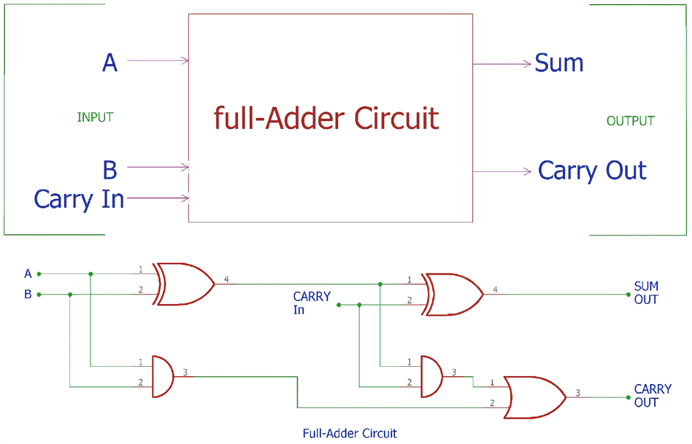

## Title: 
Design and Implementation of a Full Adder Circuit

## Objective:
- To design and implement a full adder circuit using logic gates.
- To understand binary addition with a full adder.
- To test and validate the full adder circuit.

## Apparatus:
- Breadboard
- Logic gates (AND, OR, NOT, XOR)
- Integrated circuits (74LS00, 74LS32)
- Wires, LEDs, resistors, power supply

## Components:
- 2 XOR gates (IC: 74LS86)
- 1 AND gate (IC: 74LS08)
- 1 OR gate (IC: 74LS32)
- Wires, LEDs, resistors, power supply

## Theory:
A full adder is a combinational logic circuit used in digital electronics for binary addition. It plays a crucial role in arithmetic operations and is a fundamental building block in constructing more complex digital systems.

<b>Binary Addition Process:</b>
Binary addition is the process of adding two binary numbers together, which involves performing addition digit by digit while considering the carry from the previous addition. The inputs to the full adder are two binary digits, A and B, representing the two numbers to be added, and an additional input, Cin (carry-in), representing the carry from the previous addition.

<b>Circuit Design:</b>
The full adder circuit consists of three main components: two XOR gates for adding the input bits A and B, one AND gate to generate the carry output, and one OR gate to propagate the carry.

<b>Sum (S) Generation:</b>
The sum output (S) is produced by XORing the inputs A and B and then XORing the result with Cin. The first XOR gate computes the sum of A and B (A ⊕ B), and the second XOR gate further combines the previous result with Cin (A ⊕ B ⊕ Cin), resulting in the sum output.

<b>Carry-out (Cout) Generation:</b>
The carry-out (Cout) is generated by ANDing the inputs A and B and then ORing that result with Cin. The AND gate produces the carry for each bit (A ⋅ B), and the OR gate combines the generated carry with Cin to produce the final carry-out.

### <b>Truth Table:</b>
The truth table for a full adder represents all possible combinations of input bits A, B, and Cin and the corresponding outputs Sum and Cout.

## Procedure:
1. Circuit Design:
   - Design the schematic of the full adder circuit using logic gates. The circuit should take three input bits, A, B, and Cin, and produce two output bits, Sum and Cout.

2. Gate-to-IC Mapping:
   - Map the logic gates in the circuit to their corresponding IC gates.
   - Use 74LS86 ICs for XOR gates, 74LS08 IC for the AND gate, and 74LS32 IC for the OR gate.

3. Circuit Construction:
   - Assemble the full adder circuit on the breadboard using the mapped IC gates and connect them using wires.

4. Input and Power Connection:
   - Connect the input bits, A, B, and Cin, to the appropriate inputs of the full adder circuit.
   - Provide power to the circuit using the power supply.

5. Output Verification:
   - Observe and monitor the output bits, Sum and Cout, for various combinations of input bits (A, B, Cin) using LEDs.

6. Truth Table Verification:
   - Verify that the output bits (Sum and Cout) match the expected values according to the truth table for a full adder.

## Observations and Results:
The full adder circuit operated as expected for all input combinations, matching the outputs in the truth table. The LEDs visually indicated the correct Sum and Cout outputs for different binary inputs.

## Conclusion:
The experiment to design and implement a full adder circuit using logic gates and ICs was successful. The circuit was assembled on the breadboard and tested with different input combinations. The output bits, Sum and Cout, were found to match the expected values according to the truth table for all combinations of input bits (A, B, and Cin). This confirms the proper functionality of the designed full adder circuit. The experiment provided valuable insights into binary arithmetic and the importance of full adder circuits in digital logic design.
